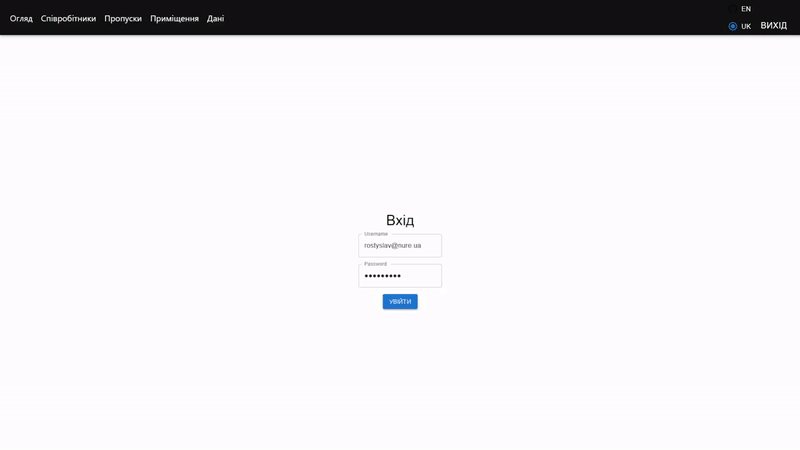

# PureAir - Air Quality and Employee Monitoring System

PureAir is a comprehensive system designed to monitor and analyze air quality and track employee presence within an industrial enterprise. It aims to enhance workplace safety, prevent hazardous situations, and improve overall productivity by providing real-time data and analytics.

## About The Project

This project was developed as a coursework for the "Software Architecture" discipline at Kharkiv National University of Radioelectronics. The primary motivation was to create an automated system that addresses the health and safety risks associated with poor air quality in industrial environments. The system provides a multi-platform solution, including a web-based dashboard for administrators, a mobile application for employees, and an IoT component for data collection.

The system is built on an N-tier, client-server architecture and consists of four main components:
*   **Web Server (Backend):** An API that handles business logic, data processing, and communication between all components.
*   **Web Application (Frontend):** A dashboard for administrators to manage the system, view analytics, and oversee operations.
*   **Mobile Application:** An app for employees to monitor their environment's conditions and view their personal data.
*   **IoT Devices:** Smart devices equipped with sensors to collect real-time data from the premises.

## Features

*   **Real-time Monitoring:** Tracks air temperature, humidity, and gas quality in real-time.
*   **Administrator Dashboard:** Allows for comprehensive management of:
    *   Employees and users
    *   Workspaces and locations
    *   Employee access passes (RFID)
*   **Data Analytics:** Visualizes environmental data through interactive charts and provides insights into potential hazards.
*   **Data Export:** Allows administrators to export filtered data to Excel for reporting.
*   **Multi-language Support:** The user interface is available in both English and Ukrainian.
*   **Mobile Access:** Employees can view workspace conditions and their personal profile data on the go.

### Built With

This project utilizes a modern stack of technologies for each of its components:

**Backend & Database:**
*   C#
*   ASP.NET Core Web API
*   Entity Framework Core
*   MS SQL Server

**Frontend (Web Application):**
*   React
*   JavaScript
*   Material-UI
*   Axios



**Mobile Application:**
*   .NET MAUI (for Android and iOS)


**IoT System:**
*   Arduino C
*   ESP8266 Wi-Fi Modules
*   **Sensors:**
    *   DHT-22 (Temperature & Humidity)
    *   MQ-135 (Air Quality & Gas)
    *   RC522 (RFID for employee tracking)


## Getting Started

To get a local copy up and running, follow these simple steps.

### Prerequisites

Ensure you have the following installed:
*   .NET SDK
*   Node.js and npm
*   SQL Server
*   Visual Studio 2022

### Installation

1.  **Clone the repo:**
    ```sh
    git clone https://github.com/MakoreviCH/PureAir.git
    ```
2.  **Backend Setup:**
    *   Navigate to the backend project folder.
    *   Update the database connection string in `appsettings.json`.
    *   Run the database migrations:
        ```sh
        dotnet ef database update
        ```
    *   Run the backend server:
        ```sh
        dotnet run
        ```
3.  **Frontend Setup:**
    *   Navigate to the frontend project folder.
    *   Install NPM packages:
        ```sh
        npm install
        ```
    *   Start the React application:
        ```sh
        npm start
        ```

## Usage

The web application provides a dashboard for administrators to monitor all connected workspaces. You can switch between different rooms, view historical data using time filters, and see the probability of hazardous situations.

## Contact

Rostyslav Pechii - [rostyslav.pechii@gmail.com](mailto:rostyslav.pechii@gmail.com)

Project Link: [https://github.com/MakoreviCH/PureAir](https://github.com/MakoreviCH/PureAir)
